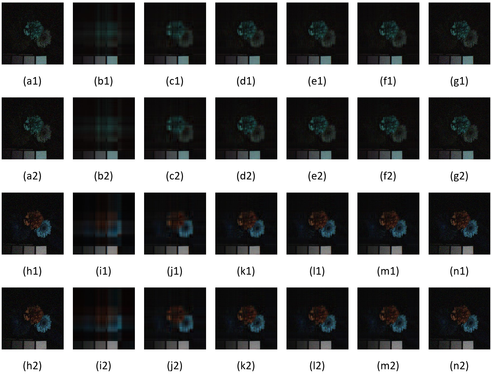
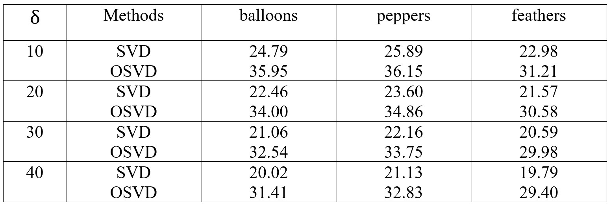

# Octonion-Signal-SVD-Image-Denoising

MATLAB Implementation of "A New Singular Value Decomposition Algorithm for 
Octonion Signal" https://ieeexplore.ieee.org/document/8546307
 
# Datasets

<a href="https://www.cs.columbia.edu/CAVE/databases/multispectral/">The Columbia Multispectral Image Database</a> is utilized in our experiment. 32 real-world scenes of a wide variety of real world materials and objects, with spectral resolution 31 and spatial resolution 512 × 512, which includes full spectral resolution reflectance data collected from 400nm  to 700nm in 10nm steps, are contained in this multispectral image data set. In our experiments, we randomly choose 7  bands (band 2, 5, 7, 12, 15, 20, 28) from the multispectral image to form a 7-channel image given by (14) and (15). 

 
# Visual results

Denoising results. (a1) and (a2) Original noisy pseudo color images (band 2, 5 and 7); (h1) and (h2) Original noisy pseudo color images (band 7, 12 and
15); (b1)–(g1) and (i1)-(n1) The denoising results with the number of singular value (2, 5, 10, 15, 20, 200) based on our OSVD method; (b2)–(g2) and (i2)-(n2) 
The denoising results with the number of singular value (2, 5, 10, 15, 20, 200) based on real SVD method

  

# Quantitative results

PSNR VALUES (DB) OBTAINED BY DIFFERENT DENOISING 
METHODS AT EACH NOISY LEVEL

  

